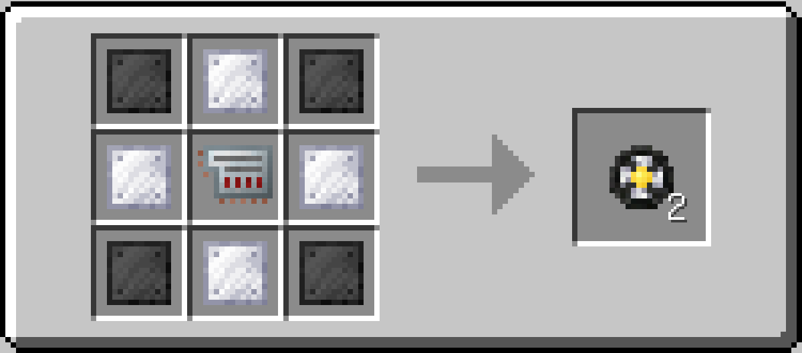
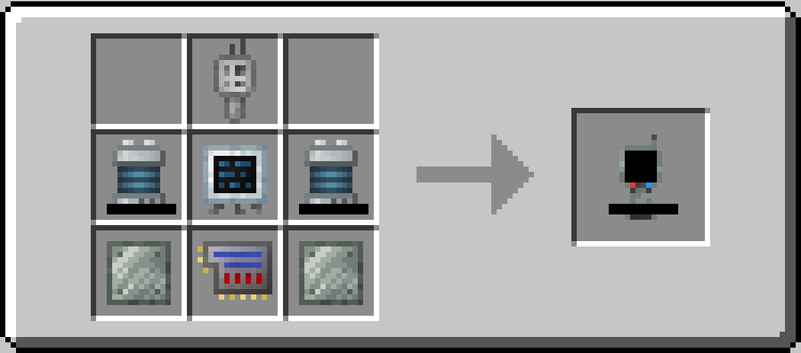
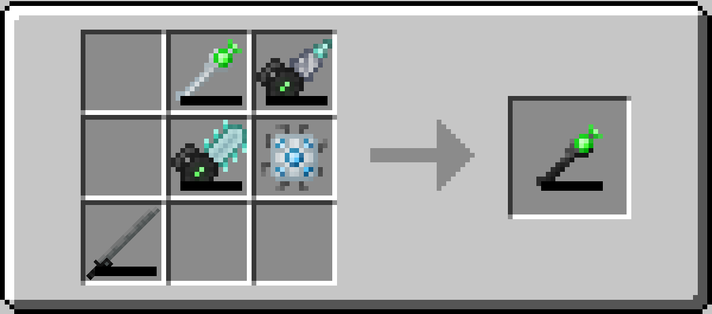
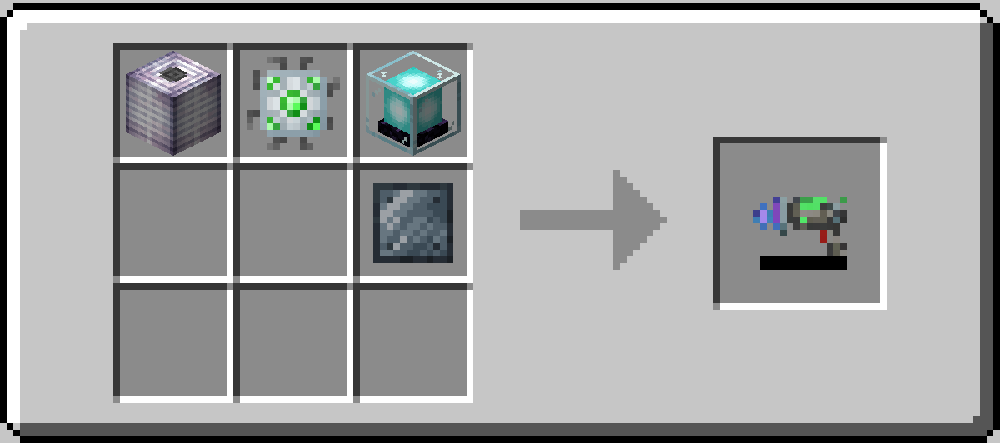
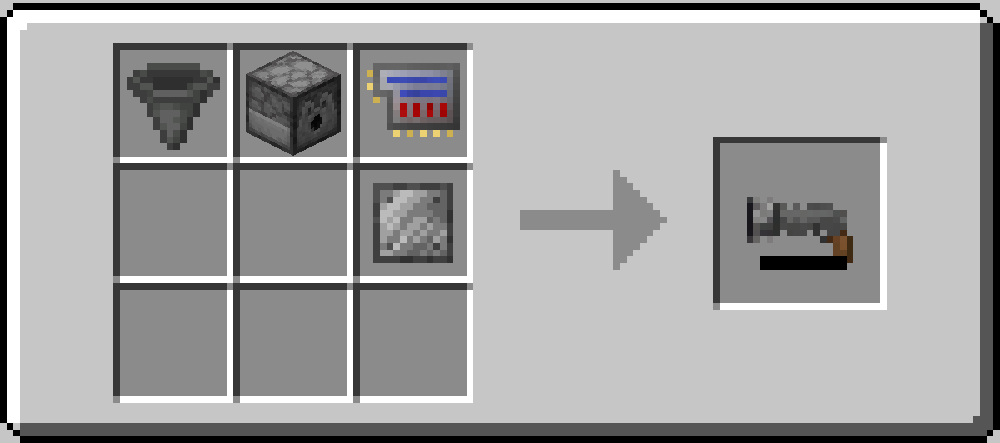

# Tech Extensions

**Tech Extensions** is a Minecraft mod that serves as an add-on for the
[Tech Reborn](https://www.curseforge.com/minecraft/mc-mods/techreborn) mod.
It introduces new high-tech gadgets and utilities to enhance the gameplay experience.

- **Current Mod Version:** 1.0.0
- **Supported Minecraft Version:** 1.21.10
- **Dependencies:**
  - [Fabric API](https://www.curseforge.com/minecraft/mc-mods/fabric-api)
  - [Tech Reborn](https://www.curseforge.com/minecraft/mc-mods/techreborn)

## Items

Currently, the mod adds six new items:

### 1. Electric Jetpack

The **Electric Jetpack** is a powerful chestplate that grants thrust-based flight.
It is a High-tier powered device with realistic physics.

#### Controls

- **Space (Jump):** Thrust upward - works from ground or in air
- **Space + WASD:** Directional flight while thrusting
- **Space + Sprint (Ctrl):** Sprint boost for faster forward movement (1.5x max speed)
- **Shift (in air):** Hover mode - slows descent and counteracts gravity

#### Mechanics

- Physics-based flight with thrust, drag, and gravity
- Horizontal and vertical speed caps for balanced gameplay
- Friction/drag slows movement gradually instead of instant stops
- Fall damage is negated while the jetpack is active
- Must be charged in a battery box or similar power source

#### Specifications

| Setting     | Default Value | Description                      |
| ----------- | ------------- | -------------------------------- |
| Capacity    | 600,000 E     | Total energy storage             |
| Flying Cost | 150 E/tick    | Energy consumed while thrusting  |
| Hover Cost  | 50 E/tick     | Energy consumed while hovering   |
| Sprint Cost | +100 E/tick   | Additional energy when sprinting |

_Look at the config file for more detailed settings and adjustments._

#### Crafting Recipe

- 1x Lithium Ion Batpack
- 2x Electric Ducted Fans (see below)
- 2x Helium Coolant Cells (60k)
- 1x Data Storage Core
- 2x Magnalium Plates

### 2. Electric Ducted Fan

The **Electric Ducted Fan** is a versatile high-tech component that serves dual purposes: as a crafting ingredient
for the Electric Jetpack, and as a **placeable block** that pushes entities with a powerful air stream.

It combines lightweight carbon materials with titanium for durability and an electronic circuit for precise motor control.

#### Block Placement & Stacking

When placed in the world, the Electric Ducted Fan becomes a powered machine that pushes any entities in front of it.
Fans can be placed facing **any of the 6 directions** (up, down, north, south, east, west) and up to
**4 fans can be stacked** on a single block, compounding their effect.

| Stacked Fans | Multiplier | Reach (min-max) | Push Strength (min-max) |
| ------------ | ---------- | --------------- | ----------------------- |
| 1            | 1.00×      | ~1-21 blocks    | ~0.05-1.00              |
| 2            | 1.52×      | ~2-32 blocks    | ~0.08-1.52              |
| 3            | 2.04×      | ~2-43 blocks    | ~0.10-2.04              |
| 4            | 2.56×      | ~3-54 blocks    | ~0.13-2.56              |

#### Power Scaling

The fan's effectiveness scales **linearly** with the energy it consumes each tick.
The more energy stored, the stronger and farther the push. When pointing upward,
the fan also resets fall distance for entities, preventing fall damage.

Energy is accepted from **any side except the front face** (the blowing direction).

#### Specifications

| Setting         | Default Value | Description                                    |
| --------------- | ------------- | ---------------------------------------------- |
| Max Energy      | 32,768 E      | Internal energy buffer                         |
| Max Input       | 16,384 E/t    | Maximum energy input rate per tick             |
| Min Energy Cost | 4 E/t         | Minimum energy consumed per tick (to activate) |
| Max Energy Cost | 16,384 E/t    | Maximum energy consumed per tick (full power)  |

_Look at the config file for more detailed settings and adjustments._

#### Crafting Recipe

- 4x Carbon Plates
- 4x Titanium Plates
- 1x Electronic Circuit
- Yields: 2 Fans

### 3. Resonance Scanner

The **Resonance Scanner** is an advanced exploration tool designed to locate specific blocks in the environment. Perfect for finding rare ores or tracking down specific materials in large caves or mining operations.

#### How to Use

1. **Open GUI:** Right-click the scanner to open its interface.
2. **Set Target:** Place a block inside the scanner's inventory slot to set it as the target (e.g., Diamond Ore).
3. **Activate:** Sneak + Right-click to toggle the scanner ON/OFF.
4. **Scan:** Hold the scanner in your Main Hand or Off Hand. It will scan in a cylindrical beam along your view direction.
5. **Feedback:** If the target block is found within range, the scanner will ping with a sound and display an **estimated distance** message.

#### Range & Consumption Mechanics

The scanner's effectiveness scales with the number of target blocks in the inventory slot:

| Mechanic    | Scaling     | Formula                       |
| ----------- | ----------- | ----------------------------- |
| Range       | Logarithmic | `6 + (10 × ln(count))` blocks |
| Energy Cost | Linear      | `100 + (10 × count)` E/scan   |

> **Tip:** Adding more blocks gives diminishing returns on range but linear increases in power cost. Find the sweet spot for your needs!

#### Upgrades

Unlike Tech Reborn machines, the scanner is a handheld item and accepts only up to **2 Upgrades**.
Right now, it only supports the following upgrade types:

| Upgrade            | Effect                                                                       |
| ------------------ | ---------------------------------------------------------------------------- |
| **Overclocker**    | Reduces cooldown between scans (faster detection), but increases energy cost |
| **Energy Storage** | Increases internal battery capacity                                          |

#### Specifications

| Setting          | Default Value | Description                              |
| ---------------- | ------------- | ---------------------------------------- |
| Capacity         | 200,000 E     | Total energy storage                     |
| Base Cost        | 100 E/scan    | Base energy per scan                     |
| Per-Item Cost    | +10 E/scan    | Additional cost per item in stack        |
| Base Range       | 6 blocks      | Minimum scanning range                   |
| Range Multiplier | 10            | Multiplier for logarithmic range scaling |
| Scan Cooldown    | 80 ticks      | Time between scans (4 seconds)           |

#### Crafting Recipe

- 1x Frequency Transmitter
- 1x Digital Display
- 2x Lithium Ion Batteries
- 1x Advanced Circuit
- 2x Invar Plates

### 4. Meta-Tool

The **Meta-Tool** is the ultimate multi-purpose tool, a significantly enhanced version of
[Tech Reborn's Omni-Tool](https://wiki.techreborn.ovh/docs/items/tools/omni_tool).

It combines the functionality of a pickaxe, axe, shovel, sword, shears (and optionally, torch!)
into a single high-capacity powered device with intelligent mining modes.

#### Features

Ever felt like the **Omni-Tool** was cool, but it felt more in the Advanced tools tier instead of
in the Industrial tools tier? The **Meta-Tool** is basically the Industrial version of the **Omni-Tool**,
with vastly improved energy capacity, faster mining speed, higher attack stats, and new intelligent mining modes.

First of all, the **Meta-Tool** includes all the functionalities of the **Omni-Tool**, reported below:

- Functions as a pickaxe, axe, shovel, sword and shears
- Strips Logs & Flattens Paths when right-clicking on appropriate blocks
- Automatically places torches from inventory when right-clicking on other blocks
- Works as a wrench for rotating and dismantling Tech Reborn machines

Unlike the **Omni-Tool**, though, the **Meta-Tool** stores 40M E, mines at the same speed
as the **Industrial Drill/Chainsaw**, and deals the same damage as the **Nanosaber**.

Additionally, it introduces different mining modes to enhance block breaking
(which can be cycled through with Sneak + Right-click):

| Mode         | Description                                                    |
| ------------ | -------------------------------------------------------------- |
| **Inactive** | Standard single-block mining                                   |
| **3×3**      | Mines a 3×3 area centered on the targeted block                |
| **Smart**    | Intelligent mode that adapts to what you're mining (see below) |

Last but not least, if you have [LambDynamicLights](https://www.curseforge.com/minecraft/mc-mods/lambdynamiclights)
installed, the **Meta-Tool** will also emit light!

##### Smart Mode Behavior

The Smart mode automatically detects what you're mining and applies the best strategy:

- **Ores:** Activates **Vein Mining** — breaks all connected ore blocks of the same type (up to 64 blocks)
- **Logs/Leaves:** Activates **Tree Capitator** — chops down entire trees (up to 64 logs + 256 leaves), similarly to the Industrial Chainsaw
- **Other blocks:** Falls back to **3×3 mining**

#### Specifications

| Setting     | Default Value | Description                         |
| ----------- | ------------- | ----------------------------------- |
| Capacity    | 40,000,000 E  | Total energy storage                |
| Mining Cost | 200 E/block   | Energy consumed per block mined     |
| Hit Cost    | 250 E/hit     | Energy consumed per enemy hit       |
| Energy Tier | Insane        | Accepts Insane-tier energy transfer |

_Look at the config file for more detailed settings and adjustments._

#### Crafting Recipe

With great power comes great crafting complexity. The Meta-Tool recipe is similar to that of the
Omni-Tool, but requires top-tier tools:

- 1x Omni-Tool
- 1x Industrial Drill
- 1x Industrial Chainsaw
- 1x Nanosaber
- 1x Energy Flow Chip

### 5. Shrink Ray

The **Shrink Ray** is an Insane-tier energy weapon that can alter the size of any living entity.
Point it at a mob (or even yourself!) to shrink, enlarge, or restore them to their original size.

#### How to Use

1. **Aim:** Point at any living entity within range (8× your entity interaction range).
2. **Fire:** Right-click to fire. The ray will hit the closest entity along your line of sight.
3. **Self-Target:** Aim at your own feet to target yourself.
4. **Switch Mode:** Sneak + Right-click to cycle between Shrink, Enlarge, and Restore modes.

#### Modes

| Mode        | Description                                               |
| ----------- | --------------------------------------------------------- |
| **Shrink**  | Reduces the target's scale (min: 1/16× base size)         |
| **Enlarge** | Increases the target's scale (max: 16× base size)         |
| **Restore** | Instantly returns the target to their original base scale |

#### Scaling Behavior

The Shrink Ray uses a **bell-curve (Gaussian) scaling model**, to put it simple, it means that
the time and cost required to change an entity's size grow exponentially as the size difference
increases. If you want to turn an entity (or yourself) into a tiny 1/16× mini-version, or a towering
16× giant, prepare for a significant energy investment and a longer transformation time.
On the other hand, small adjustments will be quicker and more energy-efficient.

#### Attribute Modifiers

When an entity's scale changes, a comprehensive set of attributes are adjusted proportionally,
giving size changes a different set of tradeoffs.

A bigger entity will have:

- More attack damage and knockback, but slower attack speed
- Faster block breaking and longer interaction range, but less luck (harder to find rare drops)
- Higher jump strength and less fall damage, but heavier gravity
- Faster movement/flying speed and higher step height (you are giant, after all)
- More resistance to knockback
- More health, but it will be harder to heal due to hunger status effect

Conversely, a smaller entity will have:

- Less attack damage and knockback, but faster attack speed
- Slower block breaking and shorter interaction range, but more luck (easier to find rare drops)
- Weaker jump strength and more fall damage, but lighter gravity
- Slower movement/flying speed and lower step height
- More vulnerable to knockback
- Less health, but easier to heal due to saturation status effect

The bigger/smaller you are, the more extreme these tradeoffs become, creating
interesting strategic choices when using the Shrink Ray in combat or exploration.

#### Specifications

| Setting  | Default Value | Description              |
| -------- | ------------- | ------------------------ |
| Capacity | 1,000,000 E   | Total energy storage     |
| Cost     | 200 E/shot    | Energy consumed per shot |

_Look at the config file for more detailed settings and adjustments._

#### Crafting Recipe

- 1x Fusion Coil
- 1x Data Storage Chip
- 1x Beacon
- 1x Tungstensteel Plate

### 6. Vacuum Gun

The **Vacuum Gun** is a multipurpose utility tool that can suck in blocks, fluids, items, and mobs
from a distance and launch them back out. It features a built-in 5-slot dispenser-like inventory,
2 upgrade slots, and intelligent interactions depending on what you suck in or launch
(again, similarly to a dispenser, but adapted for a long-range handheld tool).

#### How to Use

1. **Vacuum:** Right-click to vacuum the targeted block, fluid, item, or mob into the gun's internal inventory.
2. **Blow:** Switch to Blow mode and right-click to launch the first item in the inventory toward where you're looking.
3. **Inspect:** Switch to Inspect mode and right-click to open the gun's inventory GUI for manual management.
4. **Switch Mode:** Sneak + Right-click to cycle between Vacuum, Blow, and Inspect modes.

#### Vacuum Mode

The Vacuum mode uses raycasting to target whatever the player is looking at within range.
Targets are prioritized in this order:

| Priority | Target              | Behavior                                                                                                                                                                                                                                 |
| -------- | ------------------- | ---------------------------------------------------------------------------------------------------------------------------------------------------------------------------------------------------------------------------------------- |
| 1        | **Living Entities** | First strips equipped items one at a time. Once bare, converts to a spawn egg (preserving all NBT data and custom names) and stores in inventory. If no spawn egg exists for the mob type, it pulls the entity toward the player instead |
| 2        | **Items**           | Picks up the item entity and stores it in inventory                                                                                                                                                                                      |
| 3        | **Fluids**          | Collects source fluid blocks into a bucket (requires an empty bucket in the gun's inventory)                                                                                                                                             |
| 4        | **Blocks**          | Breaks the block and stores all drops in inventory (respects bedrock and unbreakable blocks)                                                                                                                                             |

#### Blow Mode

The Blow mode launches the first non-empty item from the gun's inventory with a **physics-based arc trajectory**
(affected by gravity and drag). Depending on the item type, special interactions occur when the item lands:

| Item Type         | Landing Behavior                                                                            |
| ----------------- | ------------------------------------------------------------------------------------------- |
| **Projectiles**   | Launched as actual projectiles (arrows, snowballs, etc.) with proper velocity and ownership |
| **TNT / Nuke**    | Primes and spawns at the landing location (supports Tech Reborn Nukes if enabled)           |
| **Spawn Eggs**    | Spawns the entity at the landing location, restoring all saved NBT data if available        |
| **Bone Meal**     | Applies growth effect (crops or water plants) at the target block                           |
| **Buckets**       | Filled buckets place their fluid; empty buckets collect source blocks at the target         |
| **Flint & Steel** | Lights TNT, campfires, or places fire at the landing location                               |
| **Shears**        | Shears sheeps, carves pumpkins, harvests honey from beehives, or stops plant growth         |
| **Blocks**        | Placed at the landing location (adjacent to the hit surface)                                |
| **Equippable**    | Equips on the nearest entity at the landing location (armor on mobs, in the correct slot)   |
| **Other items**   | Given to the nearest entity (mainhand → offhand), or dropped if no entity or hands are full |

#### Inspect Mode

Opens the Vacuum Gun's inventory GUI, allowing you to manually add, remove, or rearrange items
in the 5 inventory slots and 2 upgrade slots.

##### Upgrades

Similarly to the Resonance Scanner, the Vacuum Gun accepts only up to **2 Upgrades**.
Right now, it only supports the following upgrade types:

| Upgrade            | Effect                                                                         |
| ------------------ | ------------------------------------------------------------------------------ |
| **Overclocker**    | Reduces cooldown between actions (faster fire rate), but increases energy cost |
| **Energy Storage** | Increases internal battery capacity                                            |

#### Specifications

| Setting  | Default Value | Description                                               |
| -------- | ------------- | --------------------------------------------------------- |
| Capacity | 200,000 E     | Total energy storage (upgradeable)                        |
| Cost     | 50 E/action   | Energy consumed per vacuum or blow action                 |
| Range    | 12 blocks     | Maximum vacuum range                                      |
| Cooldown | 8 ticks       | Time between actions (0.4 seconds, reducible w/ upgrades) |

_Look at the config file for more detailed settings and adjustments._

#### Crafting Recipe

- 1x Hopper
- 1x Dispenser
- 1x Advanced Circuit
- 1x Steel Plate

## Contributing

Contributions are welcome! If you have ideas for new features, improvements, or bug fixes,
feel free to open an issue or submit a pull request on the [GitHub repository](https://github.com/Dabolus/TechExtensions).

For developers, the structure of the mod is deliberately based on the Tech Reborn
codebase to facilitate easier integration and understanding.

## License

This mod is licensed under the MIT License. See the [LICENSE.md](LICENSE.md) file for more information.
